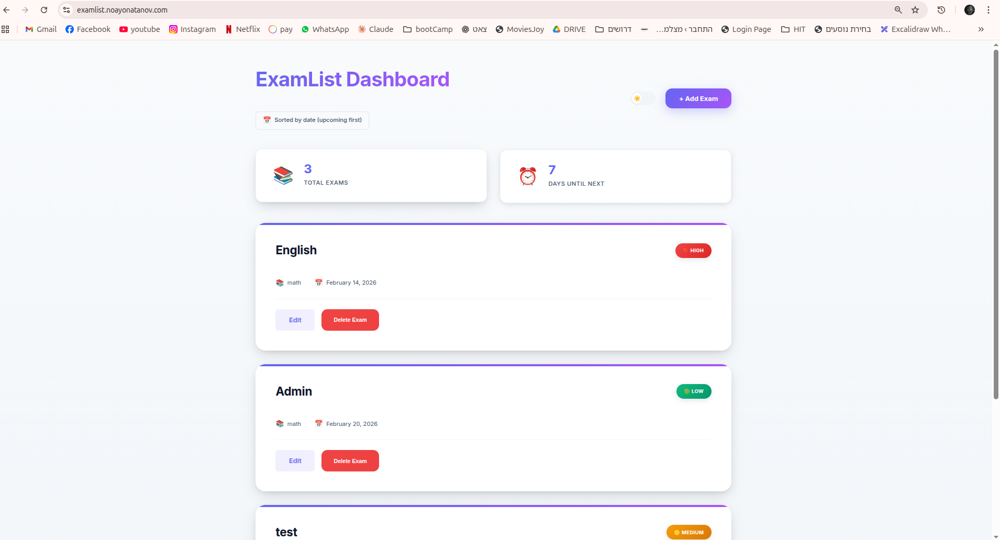
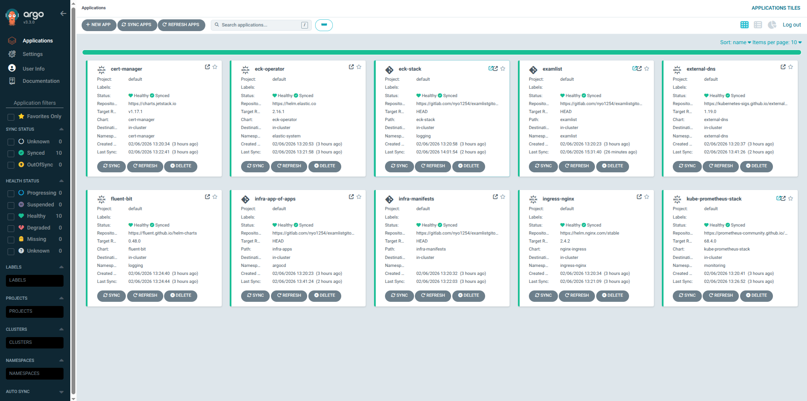
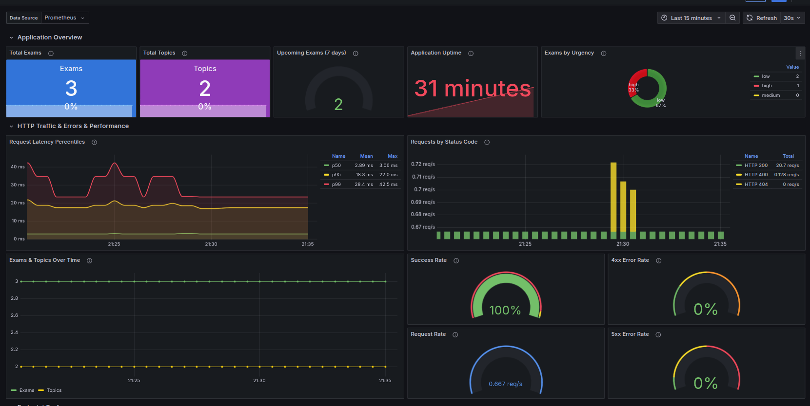
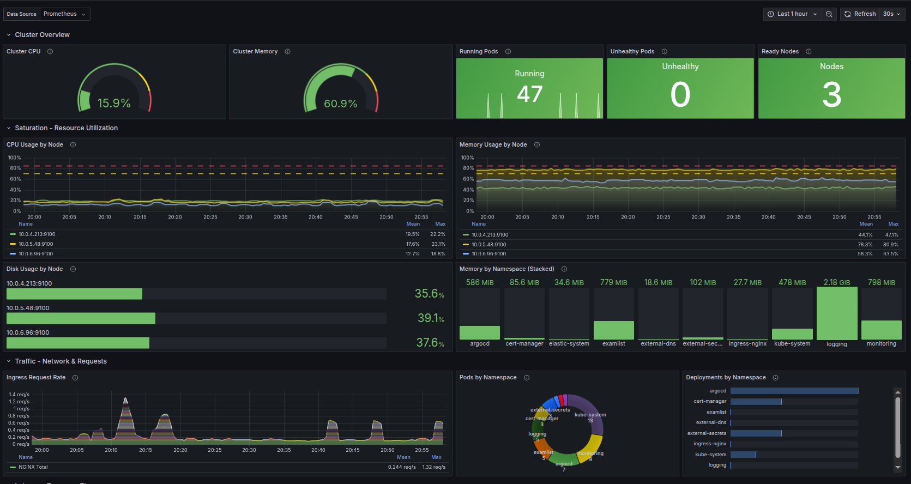
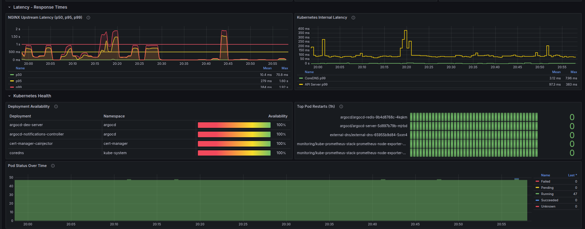
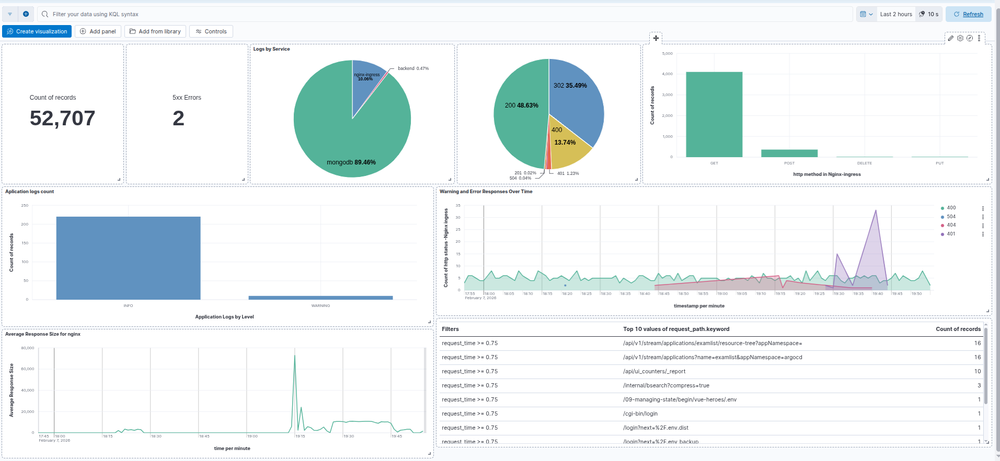
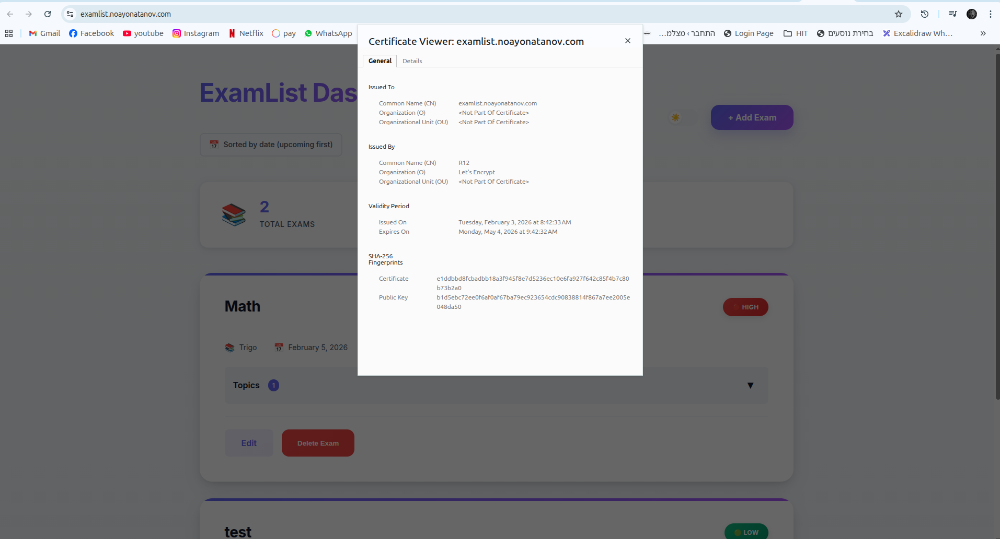

# ExamList Portfolio

<p align="center">
  
  
  
  
  
</p>

<p align="center"><strong>Full-stack exam management app deployed on AWS EKS with GitOps automation, complete observability, and Infrastructure as Code.</strong></p>

[App Repo](https://github.com/Noayo1/ExamList-App) · [Infrastructure](https://github.com/Noayo1/ExamList-Terraform) · [GitOps](https://github.com/Noayo1/ExamList-GitOps)



---

## Overview

ExamList is a web application for managing exam schedules and study topics. Users can create exams, set urgency levels, track dates, and organize study topics per exam. This portfolio demonstrates a complete production deployment across three repositories - application code, Terraform infrastructure, and GitOps deployment manifests.

---

## Architecture

### Full Flow

A developer pushes code to the `examlistnoa` application repo. Jenkins picks up the change, runs unit tests, security scans, builds a Docker image, runs integration and E2E tests, then publishes the image to ECR. Finally, Jenkins updates the image tag in the GitOps repo, which triggers ArgoCD to perform a rolling update on EKS. Frontend changes are uploaded directly to S3, served through CloudFront.


### AWS Infrastructure

All infrastructure is provisioned by Terraform. A VPC spans 3 availability zones with public subnets (for the NLB and NAT Gateway) and private subnets (for EKS worker nodes). CloudFront serves the frontend from S3 and routes `/api/*` requests to the backend through the NLB. Cloudflare manages DNS records, and ACM provides TLS certificates.


### Kubernetes

ArgoCD manages the entire cluster state using the app-of-apps pattern. A root Application points to the `infra-apps/` directory, where each file defines a child Application deployed in sync waves - secrets first, then ingress and cert-manager, then DNS and monitoring, and finally the logging stack. The ExamList application is deployed as a separate Helm chart with a Flask backend and MongoDB ReplicaSet.


### Three-Tier Application

In production, CloudFront serves the static frontend from S3 and proxies API requests to the backend through the NLB and ingress-nginx. In local development, Nginx handles both roles - serving frontend files and reverse-proxying `/api/*` to the Flask backend. The backend connects to MongoDB, which runs as a ReplicaSet (2 data nodes + 1 arbiter) with EBS persistent volumes.


---

## Repository Structure

| Repository | Description | Link |
|------------|-------------|------|
| **examlistnoa** | Flask backend, vanilla JS frontend, CI/CD pipeline, tests | [GitLab](https://github.com/Noayo1/ExamList-App) |
| **terraformportfolio** | AWS EKS infrastructure - VPC, EKS, CloudFront CDN, Cloudflare DNS | [GitLab](https://github.com/Noayo1/ExamList-Terraform) |
| **examlistgitops** | ArgoCD app-of-apps, Helm chart, infrastructure manifests | [GitLab](https://github.com/Noayo1/ExamList-GitOps) |

---

## Tech Stack

| Category | Technologies |
|----------|-------------|
| Backend | Python 3.12, Flask, Flask-RESTX, Pydantic, PyMongo |
| Frontend | Vanilla JavaScript, S3 + CloudFront (prod), Nginx (dev) |
| Database | MongoDB 7 (standalone dev, ReplicaSet prod with arbiter) |
| Infrastructure | AWS EKS, VPC, CloudFront + S3, Cloudflare DNS, ACM, Secrets Manager |
| Orchestration | Kubernetes (EKS), Helm, Docker |
| GitOps | ArgoCD (app-of-apps pattern with sync waves) |
| CI/CD | Jenkins (declarative pipeline) |
| Monitoring | Prometheus, Grafana, Alertmanager |
| Logging | Elasticsearch, Kibana, Fluent Bit (EFK stack) |
| DNS & TLS | Cloudflare, Let's Encrypt, cert-manager, ExternalDNS |
| Secrets | AWS Secrets Manager, External Secrets Operator, IRSA |
| Security | Bandit SAST, Trivy container scan, pip-audit |
| Testing | pytest (unit + integration), Playwright (E2E) |

---

## Features

- **Exam management** - create, update, delete exams with name, subject, date, and urgency level
- **Topic tracking** - add and remove study topics per exam (embedded documents in MongoDB)
- **Urgency levels** - low, medium, high with visual indicators
- **Auto-generated API docs** - Swagger UI at `/api/doc` via Flask-RESTX
- **Prometheus metrics** - custom gauges (exams total, topics total, urgency breakdown, upcoming exams, DB connections, uptime) + automatic HTTP request metrics
- **Health checks** - `/api/health` endpoint with database connectivity verification

---

## Infrastructure

- **Modular Terraform** - 3 modules (`network`, `compute`, `cdn`) provisioning VPC, EKS, and CloudFront with a single `terraform apply`
- **EKS cluster** - 3 worker nodes (t3a.medium) in private subnets, scaling up to 4, OIDC/IRSA for pod-level AWS access
- **CloudFront CDN** - S3 origin for static frontend, `/api/*` passthrough to Kubernetes ingress via NLB
- **External Secrets Operator** - AWS Secrets Manager via IRSA, ClusterSecretStore, zero secrets in Git
- **Cloudflare DNS** - automated ACM certificate validation + ExternalDNS for ingress records
- **cert-manager** - Let's Encrypt ACME with DNS-01 challenge via Cloudflare
- **EBS CSI Driver** - gp3 StorageClass for MongoDB and Prometheus persistent volumes
- **State management** - S3 backend with encryption and native lock file

---

## CI/CD Pipeline

### Jenkins (main branch)

| Stage | What it does |
|-------|-------------|
| **Version Setup** | Auto-increments patch version from latest git tag (e.g. `2.0.25` → `2.0.26`) |
| **Unit Tests** | Runs `pytest` in a `python:3.12-alpine` container |
| **Package** | Builds the backend Docker image |
| **Security Scans** | Parallel: **Bandit** (SAST) + **pip-audit** (dependency CVEs) + **Trivy** (container scan for HIGH/CRITICAL) |
| **Integration Tests** | Spins up full Docker Compose stack, runs `pytest` against live services |
| **E2E Tests** | Playwright browser tests against the running stack |
| **Git Tag** | Tags the repo with the new version |
| **Publish to ECR** | Pushes Docker image with version tag + `latest` |
| **Deploy** | Parallel: updates image tag in GitOps repo (triggers ArgoCD) + uploads frontend to S3 (if changed) |

Slack notifications on success, failure, or unstable builds.


### Feature branches

Unit tests, package, security scans, and integration tests run on `feature/*` branches. Only `main` publishes and deploys.

---

## GitOps Flow

ArgoCD watches the GitOps repo and auto-syncs to EKS. **Sync waves** ensure correct deployment ordering:

| Wave | Component | Purpose |
|------|-----------|---------|
| 1 | ExternalSecrets | Pull Cloudflare tokens and Grafana credentials from AWS Secrets Manager |
| 2 | cert-manager, ingress-nginx | TLS operator and NLB ingress controller |
| 3 | cert-manager-config, external-dns | ClusterIssuer (Let's Encrypt) and Cloudflare DNS automation |
| 4 | kube-prometheus-stack | Prometheus (10Gi EBS), Grafana, Alertmanager, Node Exporter |
| 5 | ECK operator, monitoring-config | Elastic operator and NGINX ServiceMonitor |
| 6 | eck-stack, fluent-bit | Elasticsearch (10Gi), Kibana, Fluent Bit log shipping |

All applications have `prune: true` and `selfHeal: true` - manual cluster changes are automatically reverted to match Git.



---

## Observability

### Monitoring - Prometheus + Grafana

Custom application metrics (exams, topics, urgency breakdown, HTTP latency) and infrastructure metrics (CPU, memory, nodes) scraped by Prometheus. Grafana dashboards at `grafana.noayonatanov.com`.







### Logging - EFK Stack

Fluent Bit (DaemonSet) tails container logs, parses NGINX and application HTTP logs with custom regex parsers, and ships to Elasticsearch with separate indices (`nginx-*`, `app-*`, `kubernetes-*`). Kibana dashboards at `kibana.noayonatanov.com`.



---

## Getting Started

```bash
git clone git@gitlab.com:nyo1254/examlistnoa.git
cd examlistnoa
docker compose up -d --build
```

Access at **http://localhost** - API docs at **http://localhost/api/doc** - Health check at **http://localhost/api/health**.

### Testing

```bash
# Unit tests (no MongoDB needed)
cd backend && pytest tests/unit -v

# Integration tests (requires running MongoDB)
cd backend && pytest tests/integration_tests -v --tb=short

# Coverage
cd backend && pytest --cov=app --cov-report=term-missing
```

---

## TLS Certificates

All services use Let's Encrypt certificates via cert-manager with DNS-01 challenge through Cloudflare.



---

## Future Production Upgrades

| Change | Current State | Target |
|--------|--------------|--------|
| Multi-AZ NAT gateways | Single NAT in one AZ (SPOF for egress) | Per-AZ NAT gateways for full HA |
| Restrict EKS API to private endpoint | Public + private endpoint access | Private-only (requires VPN/bastion) |
| Elasticsearch HA | Single node, no replicas | 2+ nodes with replica shards |
| ES index lifecycle management | No cleanup, 10Gi fills up | ILM policy to delete indices >30 days |
| MongoDB PVC retention | Data loss on uninstall | `whenDeleted: Retain` policy |
| HPA for backend | Fixed 2 replicas | HorizontalPodAutoscaler (2-5 replicas) |
| Grafana persistent storage | `persistence: enabled: false` | Persistent dashboards with EBS volume |
| EKS control plane logging | No logs sent to CloudWatch | Enable audit, authenticator, API server logs |
| Namespace resource quotas | No limits on namespace usage | ResourceQuotas on all namespaces |
| CDN S3 lifecycle policy | Versioning on, old versions accumulate | Expire non-current versions after 30 days |
| Prometheus storage | 10Gi | 20-50Gi based on retention needs |
